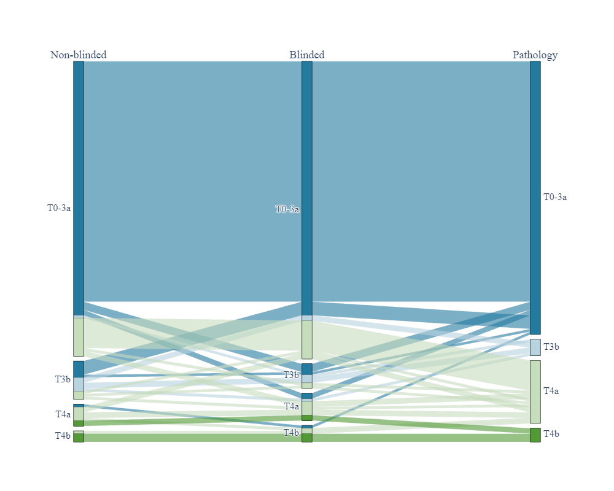

# Diagnostic accuracy of bimanual palpation in bladder cancer patients undergoing cystectomy: a prospective study


A repository containing data and code for analysis conducted in the study.   
**Authors**: A. K. Czech, K. Gronostaj, J. Fronczek, J. Frydrych, V.
Bezshapkin, M. Przydacz, P. Dudek, L. Curylo, T. Wiatr, J.
Gasowski, P. L. Chlosta  
**Corresponding author**: A. K. Czech [aka.czech@uj.edu.pl](aka.czech@uj.edu.pl)
  
## Abstract
### Purpose
<p align="justify">
To prospectively assess the concordance of examination under anesthesia (EUA)-
based clinical T stage with pathological T stage and diagnostic accuracy of EUA in patients
with bladder cancer undergoing cystectomy.
</p>

### Methods: 
<p align="justify">
Consecutive patients with bladder cancer undergoing cystectomy between June
2017 and October 2020 in a single academic center were included in a prospective study.
Two urologists performed EUA (one blinded to imaging) before patients underwent
cystectomy. We assessed the concordance between clinical T stage in bimanual palpation
(index test) and pathological T stage in cystectomy specimens (reference test). Sensitivity,
specificity, positive predictive value (PPV), and negative predictive value (NPV) were
calculated with 95% confidence intervals (CIs) to detect or exclude locally advanced bladder
cancer (pT3b-T4b) in EUA.
</p>

### Results

<p align="justify">
The data of 134 patients were analyzed. Given that stage pT3a cannot be palpated,
for the non-blinded examiner, T staging in EUA was concordant with pT in 107 (79.9%)
patients, 20 (14.9%) cases being understaged in EUA and 7 (5.2%) overstaged. For the
blinded examiner, staging was correct in 106 (79.1%) patients, 20 (14.9%) cases being
understaged and 8 (6%) overstaged. For the non-blinded examiner, sensitivity, specificity,
PPV, and NPV of EUA were 55.9% (95% CI 39.2-72.6%), 93% (88-98%), 73.1% (56-
90.1%), and 86.1% (79.6-92.6%), respectively; for the blinded examiner, they were 52.9%
(36.2-69.7%), 93% (88-98%), 72% (54.4-89.6%) and 85.3% (78.7-92%), respectively.
</p>

### Conclusion
<p align="justify">
Given that EUA could correctly determine bladder cancer T stage in 80% of
cases, its specificity and NPV, EUA should still be used for clinical staging.
</p>

***
## Citation
```
@article{czech2022bimanual, 
         author = {Anna K. Czech and Katarzyna Gronostaj and Jakub Fronczek and Jakub Frydrych and Valentyn Bezshapkin 
         and Mikolaj Przydacz and Przemyslaw Dudek and Lukasz Curylo and Tomasz Wiatr and Jerzy Gasowski and Piotr L. Chlosta}, 
         title = {Diagnostic accuracy of bimanual palpation in bladder cancer patients undergoing cystectomy: a prospective study}, 
         journal = {}, 
         volume = {},
         year = {2022}, 
         }
```
